# Introduction 
The declining birth rate and increasing life expectancy has resulted in the greying of population all around the world. Such demographic shifts will trigger changes in the labour market and world economy, and force reviews on health care and elderly support systems globally [@UN].  

As Singapore is one of the fastest ageing populations in Asia, with one in four Singaporeans aged 65 and above by 2030, it is on the cusp of an extreme demographic shift which will put immense pressure on Singapore, as a shrinking workforce struggles to support a growing ageing population [@ko:2019]. Singapore must be prepared to face this silvering challenge by evaluating every single aspect of its economy from its policies to the intergenerational dynamics. 

Issues related to population ageing are mutli-dimensional, which requires cooperation and joint efforts between different ministries and government agencies [@ko:2019]. A number of facilities and amenities have since been set up to ensure that the elderly population are well cared for and these senior citizens are able to remain independent in their silver years. For this study, we will be analysing the geographical aspect of some of these services, namely Eldercare Services, Silver Infocomm Junctions and clinics under the Community Health Assist Scheme. 

Eldercare Services are community-based services for the elderly for medical help or everyday care. These services include Home Care, which provides care at the recipient’s home; Day Care, which individuals can go to in the day and return home in the evening; and Stay-In Care, for individuals who require round-the-clock. 

Silver Infocomm Junctions (SIJs) are learning hubs conveniently located around Singapore for the elderly to kickstart their digital learning journey [@SIJ]. SIJs offer various courses that allow the elderly to pick up new skills and receive basic digital training to remain relevant as Singapore transitions into a smart nation.

Community Health Assist Scheme (CHAS) allows senior citizens who are part of the Pioneer Generation and Merdeka Generation to enjoy subsidised medical and dental services at participating clinics. This ensures that the elderly have access to affordable, quality healthcare. 

Availability and accessibility to such services are important to ensure that the elderly population of Singapore are able to receive essential care and remain independent. With increasing demand of such services due to the rise in elderly numbers [@chia:2017], it would be beneficial to conduct a study to examine how far are the services meeting the changing demand, and how accessible these services are for the elderly population in Singapore. 

This study aims to assess the geographical accessibility of Eldercare Services, SIJs and CHAS clinics for the elderly living in HDB flats in Singapore. Silver is the New Black is a client-side dynamic and interactive geo-visual analytics dashboard. The aim is to provide urban planners with an analytics tool to detect and identify planning areas and subzones with relatively lower accessibility to the above services, and to suggest possible locations for new facilities to be built. 

## Outline of Paper
This is a comprehensive report detailing our journey from analysing raw data to designing and implementing a web-enabled geo-visual analytics tool. There is a total of six sections in this study. Section 1 provides an overview of the problem and our motivation for solving it. This is followed by related works that we used as a guide for our research. Section 3 consists of detailed explanations of the research methodology used to solve the problem. Section 4 uncovers insights from our discovery, followed by a discussion based on the insights. The report concludes by looking into the future direction of the research. 

# Motivation & Objectives
Since its launch in 2013, Singapore’s Open Data initiative to promote transparency, participation and collaboration has been a massive step to achieving the Smart Nation vision [@oludumila:2018]. The data is gathered from over 70 public agencies and is available on data.gov.sg, which is a one-stop portal for all publicly available datasets [@datagov_about]. The primary motivation for our research is the general lack of integrated information and platforms on geographical visual analytics for facilities and amenities. Using data from various sources, we aim to offer a deeper insight into the geographical distribution of the elderly population and related amenities, and how accessible these amenities are for the elderly. Specifically, our application attempts to achieve the following objectives: 

1. To study the geospatial distribution of Eldercare centres, Silver Infocomm Junctions & CHAS clinics with HDB blocks; 

2. To create geographical visualisations that support both macro & micro views, on a national and planning area/ subzone level; 

3. To analyse geographical accessibility of the different facilities based on different capacities and threshold distances. 

# Related Works
While there has been countless research on geographical accessibility, we found that most research are done on primarily healthcare services that cater to the general population. In this section, we will explore some related works that serve as inspiration for this research. 

## Spatial Analysis of Nursing Homes in Chile
Like Singapore, Chile is also facing the problem of a rapidly ageing population and nursing homes have been the traditional alternative to deal with the increase in elderly population. The aim of this study [@chile] is to identify the determinants of the geographical location of nursing homes in Chile at the municipality level, taking into account the geographical criteria for different types of nursing homes and possible spatial effects. The types of nursing homes are of for-profit, not-for-profit and publicly funded. 

### Key Assumptions
Based on the eligibility criteria for publicly funded nursing homes, the criteria for the for-profit and non-profit nursing homes are derived: 

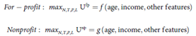

The control variables are the number of nursing homes (N), size of each nursing home (T), the price charged (P) and the location (L) of nursing homes. 

The objective of for-profit nursing homes is assumed to be profit-maximising and non-profit, to maximise social benefits. 

### Data & Methods
The datasets used include a list of nursing homes and relevant attributes, demographic and socio-economic information of municipalities and the geographical polygon data. 

To reflect the different dimensions of the decision to open a new nursing home, new variables are derived. Coverage is defined as the percentage of elderly in nursing homes in each municipality, and Availability is defined as the number of nursing homes per 10 000 elderly in each municipality. Coverage is related to the number of elders having access to nursing homes in a municipality, while availability considers the different options in terms of types of nursing homes, prices and distances. 

To decide where to open new nursing homes, one must consider the variation in variables and distribution of the elderly population across municipalities. 

The global spatial autocorrelation measure Gi* is also used in this study to identify hot spots and cold spots, i.e. municipalities with high or low availability and coverage with respect to the global average. This method is useful in our analysis as we are also interested in the availability of facilities within the study area. 

To identify the determinants of coverage and availability of nursing homes in the country, the geographical regression ordinary least squares (OLS) method is used. Using the demographic and socio-economic information, the values of coverage and availability are estimated. 

### Key Findings 1 
Fig 1 shows that spatial distribution of nursing homes and other variables of interest by municipality. Map A (Fig 1) shows that the nursing homes are clustered in central Chile, which also has the most expensive facilities. The elderly population is also clustered in that area as well (Fig 2). 

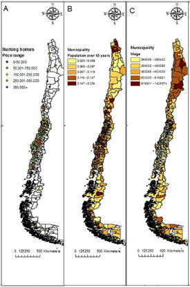

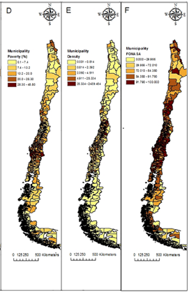

### Key Findings 2
We observe that areas with high nursing home availability (hot spots) are concentrated at the central metropolitan region and the Aysén region in the south. Lower values (cold spots) cluster mostly in the Araucania region. The clustering is similar for coverage as well, with hot spots clustered at the central region and cold spots clustered in Araucania. 

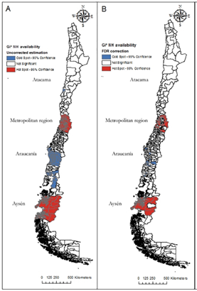

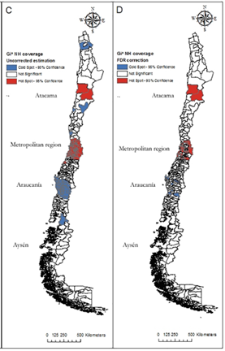

### Areas for Improvement
Due to the inherent limitations of the data itself, the analysis can only be done on a municipality level. Results may differ if it is performed on a smaller scale as decisions on the location of nursing homes and spatial autocorrelation of attribute variables are explained on a smaller scale. 

Spatial accessibility is another useful dimension to add to the analysis. The analysis studies the demand (coverage) and supply (availability) of different types of nursing homes, and the determinants of the location of nursing homes. If performed on a smaller geographical scale, spatial accessibility could be used to show how far are the nursing homes physically accessible to the elderly population, providing a more comprehensive analysis on nursing homes. 

### Conclusions
Despite the limitations above, some useful and interesting were still derived from the analysis. 

From the geographical mapping, we can see that nursing homes, in terms of both coverage and availability, tend to concentrate in areas of high demand, in municipalities with older population and higher income. This also confirms that the decisions of where to open nursing homes are also closely related to demand. 

Based on the regression estimates, there are indeed differences in decisions in terms of location and capacity between for-profit and non-profit nursing homes. Nursing homes are generally concentrated in areas with high elderly population and income, FONASA coverage is a key determinant for non-profit nursing homes and density is a key determinant for for-profit nursing homes.  These findings reveal the possible gaps between demand and supply. Coupled with insights on how the different types of nursing homes make decisions, this helps in formulating better strategies to improve access to long-term care. 

Results of this study also highlights the presence of spatial autocorrelation where entities that are geographically closer to each other tend to share similar characteristics – Tobler’s First Law of Geography. 

## Mapping the Spatial Disparities in Urban Health Care Services using Taxi Trajectories Data
This study [@taxi] presents a different approach to analyse the demand and supply of healthcare services, using movement data of taxis in Guangzhou, China. Findings of the analysis would provide insights into possible spatial inequalities to healthcare in Guangzhou. 

### Data & Methods
Taxi trajectories data is used to study the demand and supply of healthcare services. Some advantages of using taxi trajectories data include being able to retrieve origin and destination data without privacy violations, wider coverage of regions, larger data size with real-time information on position points. For areas lacking comprehensive survey data, movement data is a good alternative.  

Spatial footprints are extracted from the taxi data (Fig 5), where drop-off data that fall within the hospital polygon are considered hospital visits. The 2SFCA method is then used to derive the accessibility measure. However, the travel threshold is omitted as the hospitals could attract people from around the city, even those outside of Guangzhou. 

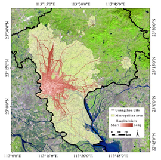

The standardised accessibility values are then compared with the standardised population density to reveal possible inequalities in healthcare. 

Preliminary findings show that majority of the total hospital visits, around 80%, are to general hospitals. Other visits that form a high proportion of total hospital visits include general hospital visits for women and children and specialised hospitals for oncology and stomatology. The average travel distance to the above hospital types range from 4.22 to 5.43 km, with standard deviations of 3.87 to 5.18 km (Fig 6). This shows that hospital visits usually occur within 10 km of travelling. 

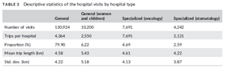

### Key Findings 1
After calculating the accessibility values, the results are classified into five levels using the natural breaks method (Fig 7). 

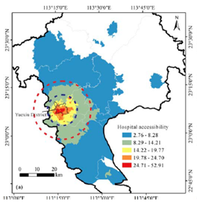

The comparison between standardised accessibility values and standardised population density is reflected in (Fig 8). Results show that 32% of areas have high population density and correspondingly high hospital accessibility, while 50% of areas have low population density and low hospital accessibility. Around 13% of communities have low population density and high hospital accessibility and 5% of communities with high population density and low accessibility. This shows presence of geographical disparities in healthcare resources in Guangzhou. 

Similar to this study, our analysis will also compare the accessibility values with elderly proportion on a subzone level. 

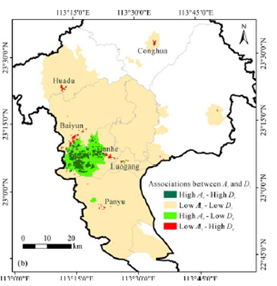

### Key Findings 2
Another joint analysis was conducted for selected general hospitals as well, using standardised hospital capacity and population density. There is a positive linear correlation between hospital capacity and potential population served (Fig 9), with three exceptions: Hospital A, B and C. Hospital A (The First Affiliated Hospital of Guangzhou Medical University) serves a large population (Fig 10), whereas Hospitals B (Guangdong Provincial Hospital of Traditional Chinese Medicine (Guangzhou University Town)) and C (Clifford Hospital) only serve its nearby communities. 

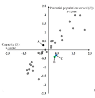

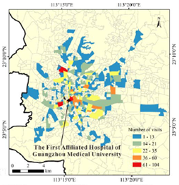

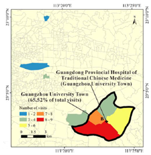

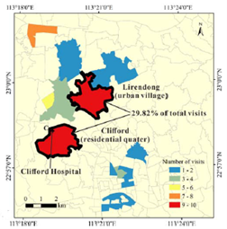

### Key Findings 3
The team also considered the problem of ageing population with hospital accessibility. After identifying elderly communities and communities with increasing aging population, a spatial analysis is conducted (Fig 13). 17% of the elderly subdistrict units and 39% of the subdistrict units with increasingly ageing population have low accessibility to hospitals. 

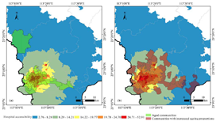

# Methodology
## Spatial Point Pattern Analysis
The use of spatial point pattern analysis (SPPA) is popular in the studying the occurrence and distribution of point data over space. It is one of the most fundamental concepts in geography. In recent years, with the rise of smart nations all around the world, Geographical Information Systems to analyse spatial data are becoming increasingly popular to uncover valuable information for effective planning, management, and development of cities. 

Under spatial point pattern analysis, we are able to visualise the distribution of points. Further analysis can be performed to identify possible spatial outliers, clustering patterns and hotspots. 

We hope to understand whether the distribution of Eldercare Services, Silver Infocomm Junctions and CHAS Clinics follow a random distribution, regular or clustered pattern, and how this distribution compares with that of HDB locations. 

Hypothesis testing method is used to determine the pattern of point distribution across space. The types of point pattern include complete spatial randomness (CSR) or regular, clustered, normal and uniform distribution (Fig 14). The null hypothesis (H0) describes that points follow a completely spatial random distribution, whereas the alternative hypothesis (H1) describes that points do not follow CSR distribution. A p-value is subsequently derived and compared to the level of significance to decide which hypothesis to reject. 

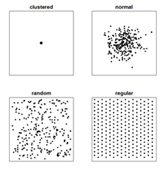

There are two levels of SPPA – the first order and second order analysis. In our analysis, both levels will be used to determine the distribution of points. 

### First Order SPPA
First Order SPPA determines whether the distribution of observations is due to changes in its underlying properties. Methods include Quadrat Analysis and Kernel Density Estimation. 

#### Quadrat Analysis
Quadrat Analysis [@quadrat] involves the study area being divided into smaller areas known as quadrats. The point density is then calculated per quadrat, by dividing the number of points with area of the quadrat. This shows the distribution of point density across the entire study area. 

H0: The distribution of points is completely random (Complete Spatial Randomness)

H1: The distribution of points is not completely random

(Alpha value = 0.001, Level of Significance: 99.9%)

Using hypothesis testing with Monte-Carlo simulation, we will be able to determine if the distribution of Eldercare Services, Silver Infocomm Junctions and CHAS clinics are randomly distributed or not. If the calculated p-value is smaller than the level of significance (alpha), null hypothesis is rejected, indicating that the distribution of points are not completely random. 

#### Kernel Density Estimation
Kernel Density Estimation (KDE) is another method to compute the intensity of point distribution. KDE maps can be used to identify hot spots, which is a more accurate visualisation than mapping points to visualise patterns. 

To calculate the KDE, we assigned bw.diggle to the sigma argument as it automatically selects the ideal bandwidth to minimise the mean squared error. The kernel function chosen is Gaussian. 

### Second Order SPPA 
Second Order SPPA determines whether the distribution of observations is due to interactions between each other. There are a number of methods such as G, F, K and L functions, which produce similar results. Since our analysis is related to demand and supply of elderly facilities, it is useful to use the K-Cross function, an extension of the Ripley’s K function [@ripley], to consider the number of one type of observations are located near those of a different type. This allows us to find out if each of the elderly facilities are clustered near HDB buildings. 

#### K-Cross Function 
The K-Cross function can be explained by the formula below: 

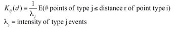

Similarly, we will once again perform hypothesis testing with Monte-Carlo simulation, with a null hypothesis that there is no clustering relationship between HDB locations and location of elderly facilities, and alternative hypothesis stating otherwise. 

The results of the K-Cross function will display the distance at which clusters (if any) start to be observed. 

### Getis-Ord Gi* Statistic
The Gi* statistic is a measure of spatial association, developed by Getis and Ord [@gi] in 1992. Given a set of points or polygon with geographical attributes, Gi* statistics identify where the high and low values cluster spatially. They are also known as hot spots and cold spots respectively. The statistic is defined as: 

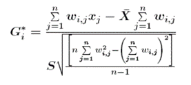

where *x_j* is the attribute value for feature *j*, *w_{ij}* is the spatial weight between feature *i* and *j*, *n* is equal to the total number of features. 

An expected Gi* value is calculated as a Z-score for the attribute of interest. The Z-score is calculated for each observation and compared to the expected Gi* value. For statistically significant positive Z-scores, the higher the Z-score, the higher the intensity of clustering for hot spots. Conversely for statistically significant negative Z-scores, the lower the Z-score, the higher the intensity of clustering for cold spots. 

## Distance Matrix
Before performing the geographical accessibility analysis, we would have to find out the distance between each HDB building and the locations of the facility of interest. The result will take the form of a matrix, where the rows are HDB buildings and columns being the specific facility. 

The function *CreateDistMatrix()* from *SpatialPosition* package is used to create the distance matrix. 

## Geographical Accessibility Analysis
One common approach for assessing geographical accessibility is by using potential spatial accessibility. This is a popular approach used by researchers and analysts to analyse the supply primary healthcare services with respect to the population using a threshold distance and capacity as well. 

Over the years, various methods such as Hansen’s Potential Model, Spatial Accessibility Model and the floating catchment area method were developed to measure geographical accessibility. For our analysis, using the distance matrix created earlier, Hansen’s Potential Model is used to derive the accessibility scores. 

### Hansen's Potential Model
Hansen’s Potential Model [@hansen] is an adaptation of the gravity model. The formula is shown below, stating that the accessibility is directly proportional to the size of the attraction and is inversely proportional to the distance to the attraction. 

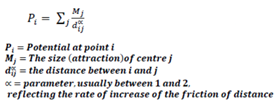

To compute spatial accessibility, the function *ac()* from *SpatialAcc* package is used. 

### Parameters 
*M_j* refers to the capacity of each facility. Due to the lack of data for the capacities, our solution is designed in a way that allows the user to select the capacity to visualise how accessibility values change with capacity. 

*D_{ij}^alpha* refers to the distance between HDB building *i* and facility *j*. This is the distance matrix computed earlier. 

alpha refers to the distance decay, which is defined as the rate of increase of the friction of distance. Due to limitations of the SpatialAcc package, only the power function can be used. In our analysis, we set alpha = 2, which is commonly used from the theory of the gravity model. 

# Data Methods & Tools
The data sets used in this study are provided by various government agencies. They are the Housing Development Board (HDB), Singapore Land Authority (SLA), Ministry of Trade and Industry, Department of Statistics, Ministry of Social and Family Development, Ministry of Health and Govtech. They are sourced from data.gov.sg. 

## Data Sources

### HDB Locations
This csv file comprises information on HDB locations and residents. This data set is then converted into a simple feature data frame using the coordinates for subsequent analysis. HDB locations are indicative for the location of the elderly, which represents the demand for amenities. 

### MP14 Subzone Data
This shapefile contains polygons that indicate subzone boundary. Subzones are divisions within a planning area. This file is crucial for our analysis as we combined this with other data sets to aggregate data by planning area & subzones. 

### Singapore Residents by Subzones & Type of Dwelling (2011 - 2019)
This data set contains residential information such as age group, sex, resident count and year by planning area and subzone. For our analysis, we will be filtering this data to obtain all 2019 data. The data is then further wrangled to obtain relevant information such as the elderly count by planning area & subzone, total resident count by planning area & subzone, elderly proportion (elderly count / total count) and elderly density (elderly count / area). 

### Eldercare Services
This KML file contains the location data of all Eldercare Services in Singapore, including names, addresses and coordinates. Then it is used to create a distance matrix for the geographical accessibility analysis. 

### Silver Infocomm Services 
This shapefile contains the location data of all Silver Infocomm Junctions and Hotspots in Singapore, including names, addresses and coordinates It is also subsequently used to create a distance matrix for the geographical accessibility analysis. 

### CHAS Clinics
This shapefile contains the location data of all General Practitioners (GPs) and dental clinics covered under the CHAS scheme, including names, addresses and coordinates It is also subsequently used to create a distance matrix for the geographical accessibility analysis. 

## Data Preparation, Cleaning & Wrangling
To obtain the relevant population data, we first had to filter the data by year 2019. Using the variables age group and resident count by planning area and subzone, combining with the MP14 Subzone Data and HDB data, we were able to derive the following variables: elderly proportion by subzone, elderly density by subzone and elderly count by HDB block. 

## Exploratory Data Analysis

### Distribution of Elderly Population
As mentioned in Section 5.1.3, variables such as elderly count, elderly proportion and elderly density were derived. We believe that the elderly proportion is the best derived variable among the three to accurately represent the distribution as it takes into account the total population by subzone. Using elderly proportion as the variable of interest, the distribution of the elderly population is visualised using the *tmap* package. 

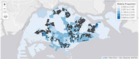

From the visualisation (Fig 15), it is apparent that the elderly proportion is generally higher in subzones with high numbers of HDB blocks. Anomalies include subzones like Loyang West where there is a high elderly proportion but little or no HDB blocks. This could be due to the presence of other housing types, such as landed properties and condominiums where the elderly could reside as well, highlighting one major area for improvement for the current analysis. 

To identify subzones with exceptionally high elderly proportions (outliers), a custom function is being implemented and the results are plotted (Fig 16). We find that the subzone Loyang West has an exceptionally high proportion of elderly. Other areas around Jurong, Bishan, Tampines and Choa Chu Kang also has high elderly proportions. 

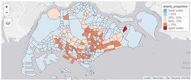

### Distribution of Elderly Facilities
Using the data available, the locations of Eldercare Services, Silver Infocomm Junctions and CHAS Clinics can also be plotted (Fig 17). 

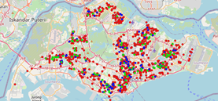

As expected, the facilities are largely located in the residential areas. There is a higher number of CHAS clinics compared to other facilities. This could be because these clinics serve the general population in Singapore, not only the elderly population. 

# Implementation & Results

## Spatial Point Pattern Analysis

### Quadrat Analysis
The quadrat analysis produced significant results for the distribution of CHAS clinics, but the results remain insignificant for Eldercare Services and Silver Infocomm Junctions. After performing a Monte-Carlo quadrat test for 2999 simulations and an alpha value of 0.001, quadrat test for CHAS clinics gave a p-value of 0.0006667, Eldercare Services 0.009333 and Silver Infocomm Junctions 0.044. 

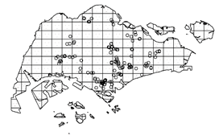

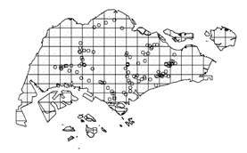

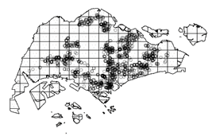

We can conclude that the distribution of CHAS clinics is random. On the other hand, we can reject the null hypothesis for Eldercare Services and Silver Infocomm Junctions, the distribution of these two facilities follow either a regular or cluster pattern. 

### Kernel Density Estimation
Rescaling the distance from metres to kilometres, we were able to produce the following Kernel Density Estimation (KDE) maps to display the distribution of Eldercare Services, Silver Infocomm Junctions and CHAS Clinics in Singapore (Fig 19a, b, c).

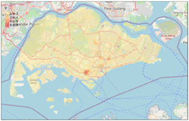

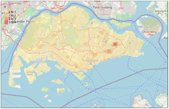

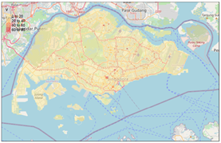

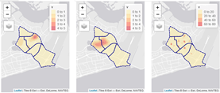

We also performed KDE on a planning area level. This is an example of KDE maps analysing the density of Eldercare Services, Silver Infocomm Junctions and CHAS Clinics respectively (Fig 20).

### K-Cross Function
We performed the K-Cross analysis on a planning area level, one for each facility type for 99 simulations. For Tampines planning area (Fig 21), the computed K-Cross values (in black) are generally higher than poisson K-Cross values (in red), indicating that the facilities of interest are indeed clustered around HDB locations; there is spatial dependence between the facilities and HDB locations. 

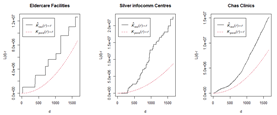

### Getis-Ord Gi* Statistic
To identify the hot spots and cold spots, the Gi* statistic was computed and mapped for each of the facilities by planning area. 

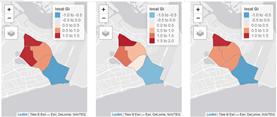

For Tampines planning area, the subzone Tampines North is a common hotspot for Eldercare Services, Silver Infocomm Junctions and CHAS clinics, while the subzone Xilin is a common cold spot for the above facilities. 

## Geographical Accessibility
Using the distance threshold of 1 km and capacity of 50, the Hansen Model is used to compute the accessibility values. The values can be mapped by subzone (Fig 23) and HDB blocks (Fig 24). 

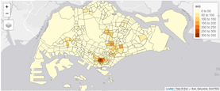

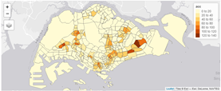

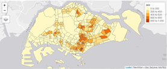

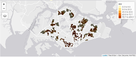

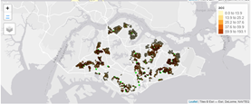

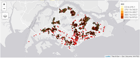

For Eldercare Services and Silver Infocomm Junctions, it is apparent that most of the darkest spots (the most accessible HDB blocks) are located around areas where the elderly proportions are high. This is expected as the purpose of these facilities are designed to serve the elderly population better. Taking into consideration problems associated with aging such as mobility issues, placing Eldercare Services and Silver Infocomm Junctions near to where the majority of the elderly reside would certainly enable the elderly to reach these facilities more easily. 

On the other hand, while our analysis shows that HDB blocks are highly accessible to CHAS clinics, it is also worth noting that CHAS clinics are also located in areas where there are little or no HDB blocks as well. These clinics offer services to elderly under CHAS, but they too serve a larger Singapore population, thereby explaining the distribution of CHAS clinics around the country. 

# Discussion
Based on our exploratory data analysis, we can observe the elderly proportion by subzone (Fig 15) and identify subzone with exceptionally high elderly proportion (Fig 16). This helps to identify the specific subzones with high elderly proportion. 

Another way to identify subzones with high elderly proportion is by the hotspot & coldspot analysis using Getis-Ord Gi* statistic (Fig 22). The hotspot & coldspot analysis for Eldercare Services and Silver Infocomm Junctions helps to identify areas with high supply (hence demand) of these facilities. 

Using the accessibility analysis, we are able to estimate the extent to which the supply is meeting the demand. The elderly population residing in subzones or HDB blocks with high accessibility will be able to commute to these facilities relatively easier. Urban planners can also take advantage of the accessibility information to decide where new facilities should be built and the kind of new infrastructure to put in place to improve accessibility of facilities to the elderly. This could include shuttle services and introducing virtual platforms to bridge the gaps in accessibility. 

# Future Work
We believe that there is ample headroom for further improvements on our analysis. Currently, only the locations of Eldercare Services, Silver Infocomm Junctions and CHAS Clinics are being considered to determine the physical accessibility of these facilities to the elderly population and how far are the needs of the elderly being met. However, we find that our analysis could be expanded to include the non-physical aspects of accessibility. As Singapore is slowly becoming a smart nation, plenty of services are moving onto digital platforms and physical accessibility becomes less of a concern to many. More data such as the ICT penetration rate of the elderly population will be useful to provide a more comprehensive analysis. 

In terms of transferability, we believe that our analysis can also be used to analyse the accessibility for facilities for different segments of the society. For example, for young families, it would be useful to analyse the accessibility of childcare centres and kindergartens, as well as for the business districts in Singapore. The expansion of our current analysis would certainly help to improve urban planning in Singapore, which would ideally bring about an elevated quality of life for the entire population. 

# Acknowledgements
We would like to thank Dr. Kam Tin Seong, the Associate Professor of Information Systems (Practice), for guiding us throughout our journey. His enthusiasm and passion for geospatial analytics never fail to inspire us. 

# References

---
references:
- id: 1
  title: Professinal Android 4 Application Development
  author: 
  - family: Meier
    given: Reto
  type: book
  publisher: John Wiley & Sons, Inc.
  issued:
    year: 2012
    month: 5
- id: fenner2012a
  title: One-click science marketing
  author:
  - family: Fenner
    given: Martin
  container-title: Nature Materials
  volume: 11
  URL: 'https://doi.org/10.1038/nmat3283'
  DOI: 10.1038/nmat3283
  issue: 4
  publisher: Nature Publishing Group
  page: 261-263
  type: article-journal
  issued:
    year: 2012
    month: 3
...

